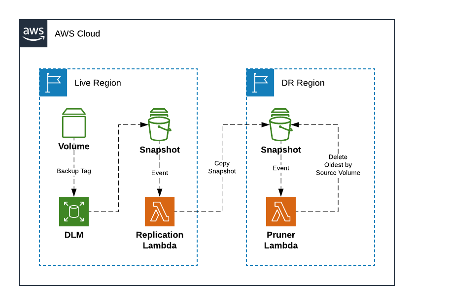

# EBS DLM Backup and Cross Region Replication

CloudFormation templates utilizing AWS DLM to backup EBS Snapshots 
based on tags and replicates to DR Region. Terraform for installing
templates is included. It is implemented with one stack per region,
live and DR.

## Overview



## Usage

```hcl-terraform
// Live region
provider "aws" {
  version = "~> 1.52"
  region  = "us-east-2"
}

// DR region
provider "aws" {
  alias   = "uw2"
  version = "~> 1.52"
  region  = "us-west-2"
}

// Install the backup module
module "backup" {
  source = "github.com/webdevwilson/ebs-dlm-backup-replicate"

  providers = {
    aws    = "aws"
    aws.dr = "aws.uw2"
  }

  replication_region = "us-west-2"
}
```